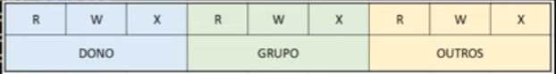
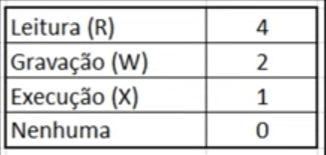

# Conhecendo o sistema de permissões

    -rw-r--r--
    drwxr-xr-x

R - Read (leitura)

W - Write (gravação)

X - Execute (execução)

Nenhuma das permissões se enquadram para o usuário root (super usuário).

Para alterar configurações de dono (change owner):

    mkdir /adm
    mkdir /ven

    chown debora:GRP_ADM /adm/
    chown mariana:GRP_VEN /ven/

Para alterar permissões de RWX no comando chmod:

Essa tabela é utilizada como uma soma, no caso, o CHMOD é composto por:

    chmod (dono, grupo, outros)

    chmod (RWX, RX, )

    chmod (4+2+1, 4+1, 0)

    chmod 750 /adm/

Outro exemplo:

    chmod (dono, grupo, outros)

    chmod(RWX, RWX, RX)

    chmod (4+2+1, 4+2+1, 4+1)

    chmod 775 /ven/

Também é possível adicionar uma certa permissão:

    chmod +x date.sh