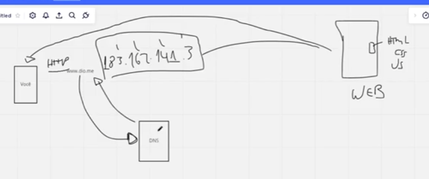

# O que é um servidor WEB

Os dados de um site, imagens, documentos, videos, etc, são guardados em um servidor.

Ao buscar um site no navegador, precisamos saber o IP do servidor para pegar os arquivos e conseguirmos abrir o site, mas nós não digitamos diretamente o endereço de IP para abrir um site.

Para isso nós temos um Servidor DNS que funciona como intermediador, ao fazermos uma busca, ele dirá o endereço de IP para podermos acessar o site.

DNS: Domain Name System

