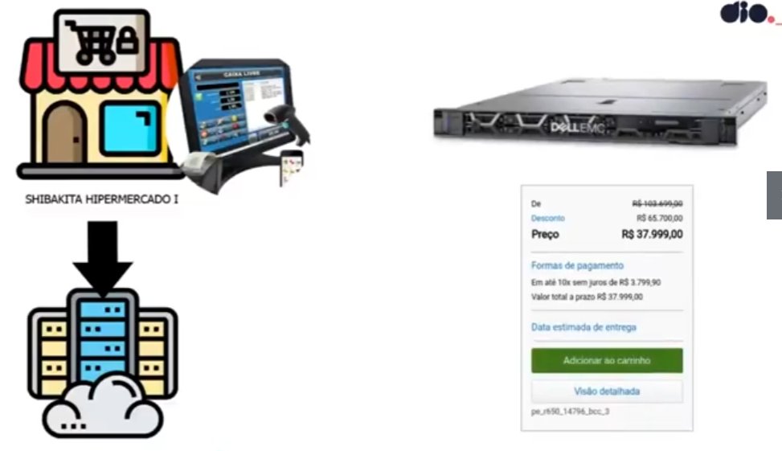

# Docker: Utilização prática no cenário de microsserviços

"[Aplicações em Bare Metal até a Conteinerização em Nuvem Pública]

## **Guia**

https://github.com/denilsonbonatti/toshiro-shibakita

## **"Problemas" com a nuvem privada**

1. Dificuldades com a segurança da Tecnologia da Informação (lógica e física)
2. Custo com mão de obra especializada
3. Custo de Hardware
4. Custo de Energia elétrica
5. Falta de Energia (uso de geradores)
6. Despesas inesperadas

## **Vantagens de migrar para a nuvem pública**

1. Preço (pague somente o que usar)
2. Facilidade de contratação, configuração e infraestrutura
3. Escalabilidade
4. Performance

## 