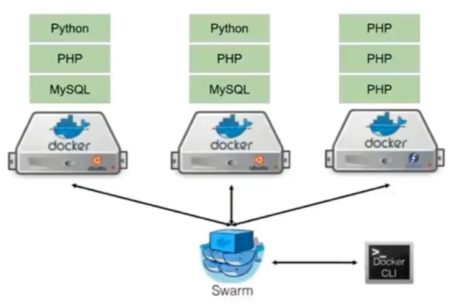

# Microserviços

Microsserviços são um tipo inovador de arquitetura de software, que consiste em construir aplicações desmembrando-as em serviços independentes. Estes serviços se comunicam entre si usando APIs e promovem grande agilidade em times de desenvolvimento.

Hoje, gigantes do mercado como Netflix e Spotify, divulgam a receita do sucesso ao transformar suas aplicações monolíticas em mais de 500 microsserviços.

Quando quebramos uma aplicação monolítica em várias pequenas partes, conseguimos escalá-las de forma separada. Supondo que um serviço de autenticação seja chamado várias vezes durante a sessão de um usuário, com certeza o stress sobre ele é maior.

Com microsserviços, podemos escalar apenas uma parte, ao invés de ter que escalar a aplicação como um todo, como ocorre em uma arquitetura monolítica.

Os microsserviços não necessariamente precisam ser escritos usando a mesma linguagem de programação.

